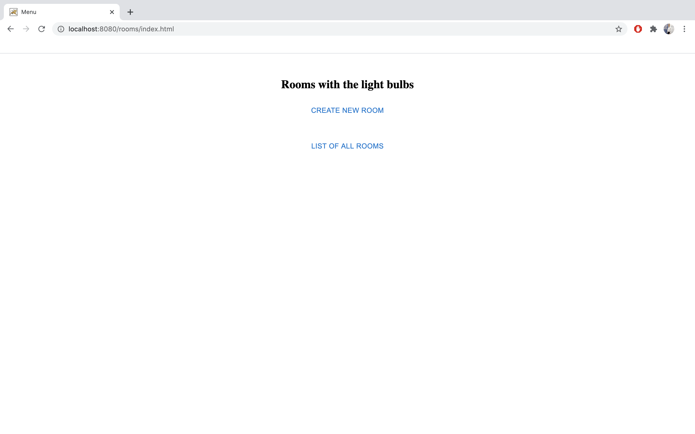
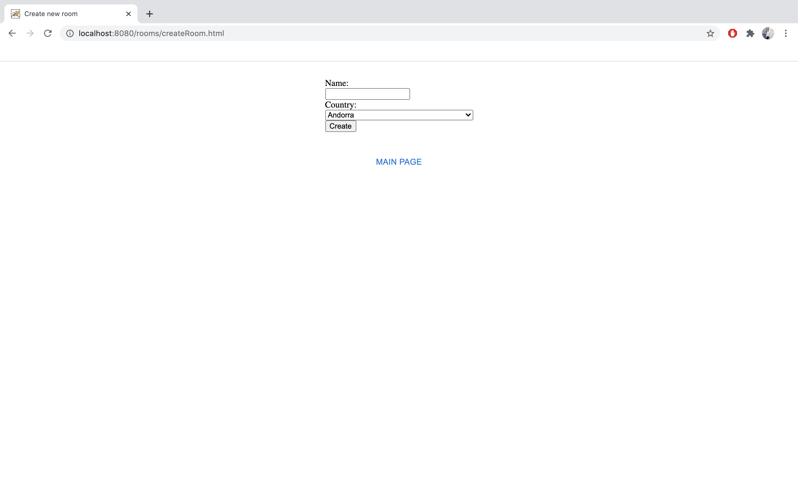
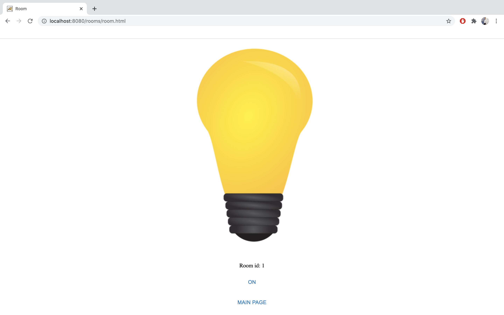
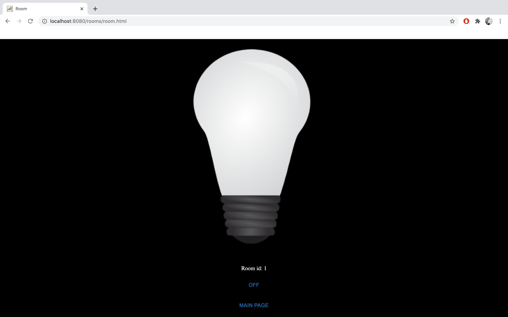

# Test task for ITS Partner LLC

🖥 Приложение “Комнаты с лампочками”

Заходя на веб страницу, пользователь имеет возможность:

- создать комнату, указав ее имя и страну из списка. Страна нужна, чтобы ограничить пользователям доступ в комнату.

- просмотреть список созданных комнат (включая комнаты, созданные другими пользователями)

- “зайти” в одну из комнат и включить/выключить лампочку, находящуюся в ней.

Если страна пользователя отличается от страны комнаты, то при попытке входа в комнату пользователю показывается ошибка.

Определение страны производится по IP адресу пользователя.

Изменение состояния лампочки должно отображаться для всех пользователей в комнате (как можно быстрее, без перезагрузки страницы).

Логин\регистрация не нужны.

Требования к реализации:

- Язык программирования серверной части - Java

- UI может быть тривиальным

- Unit/Integration тесты

- Должно быть реализовано сохранение состояния между перезапусками приложения

- Очень желательно иметь возможность запускать одной консольной командой без установки сторонних зависимостей. Если очень хочется использовать docker/docker-compose.

---

For now:

1. clone the project
```
git clone https://github.com/ivanshilyaev/roomsWithTheLightBulbs
```

2. import it into Intellij using Maven;

3. add Artifact Web Application: Exploded -> From Modules -> roomsWithTheLightBulbs -> Apply;

4. install Tomcat and add Tomcat Server Local configuration using created artifact;

5. run the application.

Soon this [link](https://rooms-with-the-light-bulbs.herokuapp.com/) will be available.

List of technologies used:

- Java 8 (14)

- Maven 3.6.3

- Tomcat 9.0.31

- Servlets, JSP, WebSockets

- MySQL 8.0.20

- JUnit 5.1.0

- Log4j2 2.13.0

- Gson 2.8.6

-  GeoIP2 2.14.0

- IntelliJ IDEA 2020.1.2

Appearance:









by [@ivanshilyaev](https://github.com/ivanshilyaev), 2020
